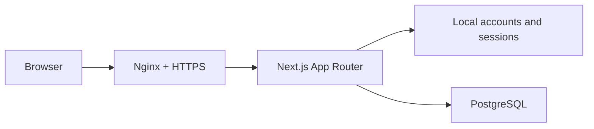

<p align="center">
  
</p>

<h1 align="center">A Birthday Worth Celebrating</h1>

<p align="center">
  Meet adults in the same city who share your birthday and want a similar kind of celebration.
</p>

<p align="center">
  <a href="./README.md">简体中文</a> ·
  <a href="#quick-start">Quick start</a> ·
  <a href="#self-hosting">Self-hosting</a>
</p>

## What it does

The app filters candidates by city, birthday, and mutual group preferences. It then scores compatible profiles by celebration style, budget, group size, and shared activities.

Contact details remain private until both people choose “interested.”

## Features

- Local email-and-password registration and sign-in
- Salted `scrypt` password hashes
- HTTP-only, SameSite sessions with token digests stored in PostgreSQL
- Adult-only profile onboarding
- Same-city and same-birthday matching
- Mutual group-preference checks
- Compatibility scoring and mutual connections
- Reporting, blocking, and profile pausing
- Docker Compose, Nginx, health checks, and database backups

## Architecture



| Layer | Technology |
| --- | --- |
| Web | Next.js 16, React 19, TypeScript |
| Authentication | Local credentials, scrypt, database-backed sessions |
| Data | PostgreSQL 15 |
| Validation | Zod |
| Tests | Vitest and PostgreSQL integration tests |
| Deployment | Docker Compose, Nginx, Let's Encrypt |

## Quick start

Node.js 20.9+ and PostgreSQL are required.

```bash
git clone https://github.com/rfdiosuao/birthday-match.git
cd birthday-match
npm install
cp .env.example .env.local
```

Apply [`database/schema.sql`](./database/schema.sql), configure `DATABASE_URL`, and run:

```bash
npm run dev
```

Quality checks:

```bash
npm run typecheck
npm run lint
npm test
npm run build
```

## Self-hosting

Copy `.env.example` to `.env.production`, set a long random database password and your public HTTPS URL. A public support email is optional because the site includes a support form. Then run:

```bash
docker compose --env-file .env.production up -d --build
```

The app listens on `127.0.0.1:3020` by default. PostgreSQL is available only on the private Compose network. Install [`deploy/nginx.conf`](./deploy/nginx.conf) and use Certbot to enable HTTPS. When the DNS record is proxied through Cloudflare, also install [`deploy/cloudflare-realip.conf`](./deploy/cloudflare-realip.conf) under `/etc/nginx/conf.d/` so logs and authentication rate limits use the real visitor IP instead of a shared Cloudflare edge address.

Run schema migrations:

```bash
APP_DIR=/opt/birthday-match ./deploy/migrate.sh
```

Create a database backup:

```bash
APP_DIR=/opt/birthday-match ./deploy/backup.sh
```

Run the operational health check:

```bash
APP_DIR=/opt/birthday-match ./deploy/healthcheck.sh
```

The `/support` form accepts account-recovery, safety, and privacy requests. An explicitly assigned administrator can review support tickets and reports at `/admin`; administrator privileges must never be granted automatically to newly registered accounts.

## Security boundaries

- Login emails never appear in candidate profiles.
- Passwords are stored only as salted, irreversible hashes.
- Raw session tokens exist only in HTTP-only browser cookies.
- PostgreSQL is not exposed to the public internet.
- Contact details are returned only to mutually connected users.
- Reported users are removed from each other’s candidate pool.
- Banning an account invalidates its sessions, pauses its profile, and hides its contact details from historical matches.

Review local privacy, data-protection, age-restriction, and event-liability requirements before operating the service.

## License

[MIT](./LICENSE)
