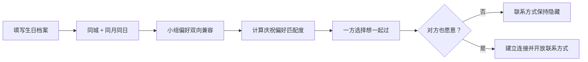
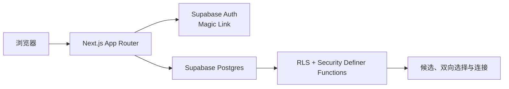

<p align="center">
  <a href="https://github.com/rfdiosuao/birthday-match">
    
  </a>
</p>

<h1 align="center">今年我想好好过生日</h1>

<p align="center">
  让同一座城市、同一天生日，也想认真庆祝的人，在双方同意后认识彼此。
</p>

<p align="center">
  <a href="./LICENSE"></a>
  
  
  
</p>

<p align="center">
  <a href="#快速开始">快速开始</a> ·
  <a href="#匹配机制">匹配机制</a> ·
  <a href="#部署">部署</a> ·
  <a href="https://github.com/rfdiosuao/birthday-match/issues">问题反馈</a>
</p>

<p align="center">
  
</p>

## 这是什么

「今年我想好好过生日」是一个面向成年用户的同城生日匹配网站。它先用生日月日、城市和小组偏好确定候选范围，再根据庆祝方式、预算、人数和共同活动计算匹配度。

候选阶段不展示联系方式。只有双方都选择 **“想一起过”**，系统才建立连接并向彼此开放联系方式。

### 核心原则

| 原则 | 产品行为 |
| --- | --- |
| 同一天、同一座城 | 生日月日和标准化城市必须完全一致 |
| 双向选择 | 单方面感兴趣不会开放联系方式 |
| 隐私克制 | 不收集出生年份、身份证或精确住址 |
| 安全优先 | 支持小组偏好、暂停档案、举报和屏蔽 |

## 已实现

- 邮箱 Magic Link 免密码登录
- 三步生日档案与年满 18 周岁确认
- 同城、同月同日硬筛选
- 小组性别偏好双向兼容检查
- 庆祝方式、预算、人数与共同活动匹配度
- “想一起过 / 这次不合适”双向选择
- 双向同意后建立连接并开放联系方式
- 举报后双方不再互相出现在候选列表
- 档案暂停、隐私政策、用户协议和安全守则
- Supabase Row Level Security（RLS）与受控数据库函数

## 匹配机制



进入候选列表前，双方必须满足：

1. 城市标准化结果一致（自动忽略末尾“市、区、县”等行政区后缀）。
2. 生日月日一致。
3. 小组性别偏好彼此兼容。
4. 双方档案均处于开启状态。
5. 双方之间不存在举报、屏蔽或已经建立的连接。

满足条件后，匹配度按以下规则计算：

| 评分项 | 分值 |
| --- | ---: |
| 基础分 | 20 |
| 庆祝方式相同 | +28 |
| 预算相同或一方选择“可商量” | +20 |
| 期待人数相同 | +12 |
| 每项共同活动 | +8，最多 +32 |
| 最高分 | 100 |

评分实现同时存在于 [`src/lib/matching.ts`](./src/lib/matching.ts) 和数据库候选函数中；前者用于单元测试，后者负责真实候选排序。

## 技术架构



| 层 | 技术 |
| --- | --- |
| Web | Next.js 16、React 19、TypeScript |
| 登录 | Supabase Auth Magic Link |
| 数据 | Supabase Postgres |
| 数据权限 | RLS + `security definer` 数据库函数 |
| 校验 | Zod |
| 测试 | Vitest |
| 部署 | Vercel + Supabase |

## 快速开始

当前验证环境为 Node.js `v24.6.0`、npm `11.5.1`。

```bash
git clone https://github.com/rfdiosuao/birthday-match.git
cd birthday-match
npm install
cp .env.example .env.local
npm run dev
```

Windows PowerShell 可将复制命令替换为：

```powershell
Copy-Item .env.example .env.local
```

打开 `http://localhost:3000`。使用示例环境变量时可以查看公开页面；邮箱登录和真实匹配需要先完成下方 Supabase 配置。

## 配置 Supabase

### 1. 建立数据库

1. 创建一个 Supabase 项目。
2. 打开 SQL Editor。
3. 完整执行 [`supabase/schema.sql`](./supabase/schema.sql)。
4. 在 Project Settings → API 中取得 Project URL 和 anon public key。

SQL 会创建：

- `profiles`、`reactions`、`connections`、`reports` 四张表。
- 用户只能直接读写自己档案的 RLS 策略。
- 返回有限候选信息的 `get_birthday_candidates()`。
- 处理双向选择的 `respond_to_candidate()`。
- 仅向已连接双方返回联系方式的 `get_my_connections()`。

### 2. 配置邮箱登录

在 Supabase Authentication 中：

1. 开启 Email Provider。
2. 设置正式 Site URL。
3. 将正式站点的 `/auth/callback` 加入 Redirect URLs。
4. 本地开发时额外加入 `http://localhost:3000/auth/callback`。

### 3. 配置环境变量

复制并编辑 [`.env.example`](./.env.example)：

| 变量 | 用途 |
| --- | --- |
| `NEXT_PUBLIC_SUPABASE_URL` | Supabase Project URL |
| `NEXT_PUBLIC_SUPABASE_ANON_KEY` | Supabase anon public key |
| `NEXT_PUBLIC_SITE_URL` | 当前站点的完整公开地址 |
| `NEXT_PUBLIC_SUPPORT_EMAIL` | 隐私请求和安全问题联系邮箱 |

不要提交 `.env.local`。仓库的 [`.gitignore`](./.gitignore) 已默认忽略所有真实环境文件，只保留 `.env.example`。

## 可用命令

| 命令 | 作用 |
| --- | --- |
| `npm run dev` | 启动本地开发服务器 |
| `npm run build` | 创建生产构建 |
| `npm run start` | 启动已经构建的生产服务 |
| `npm run typecheck` | 执行 TypeScript 类型检查 |
| `npm run lint` | 执行 ESLint |
| `npm test` | 运行 Vitest 测试 |

发布前建议完整运行：

```bash
npm run typecheck
npm run lint
npm test
npm run build
npm audit --omit=dev
```

## 部署

### Vercel

1. Fork 本仓库，或将它导入自己的 GitHub 账号。
2. 在 Vercel 新建项目并选择该仓库。
3. 添加 [`.env.example`](./.env.example) 中列出的四个环境变量。
4. 部署后，将最终域名同步到 `NEXT_PUBLIC_SITE_URL`。
5. 在 Supabase Authentication 中同步更新 Site URL 和 Redirect URLs。
6. 重新部署一次，使站点元数据使用最终域名。

Vercel 能自动识别 Next.js，无需自定义构建命令。

## 安全与隐私边界

- 登录邮箱不会出现在候选资料中。
- 联系方式保存在档案中，但候选查询函数不会返回该字段。
- 只有数据库中已经建立连接的双方可以通过受控函数取得联系方式。
- 举报关系会阻止双方再次进入彼此的候选结果。
- 首次线下见面应选择公共场所；仓库中的 [`src/app/safety/page.tsx`](./src/app/safety/page.tsx) 提供了用户安全守则。

上线前仍需根据实际运营主体、部署地区和目标用户所在地，复核隐私政策、数据跨境、未成年人保护和线下活动责任。

## 当前限制

- 仓库暂未提供官方线上 Demo。
- 举报会被记录和屏蔽，但运营者仍需建立人工审核流程与响应时限。
- 没有内置聊天功能；匹配后由双方使用自愿公开的联系方式沟通。
- 还没有后台管理界面、端到端邮箱测试或自动化 CI 工作流。
- 城市使用文本标准化，而不是行政区划编码。

## 项目结构

```text
src/app/                 页面、API Routes 与公开政策
src/components/          登录、档案、候选和连接组件
src/lib/                 匹配算法、校验规则与 Supabase 客户端
supabase/schema.sql      数据表、RLS、索引与匹配函数
.env.example             安全的环境变量模板
```

## 参与贡献

欢迎提交 [Issue](https://github.com/rfdiosuao/birthday-match/issues) 讨论缺陷、匹配规则和安全体验。提交 Pull Request 前，请先运行类型检查、Lint、测试和生产构建，并避免提交真实邮箱、联系方式或 Supabase 凭据。

如果报告内容涉及可被利用的隐私或权限问题，请不要在公开 Issue 中附带真实用户数据。

## 开源许可证

本项目采用 [MIT License](./LICENSE)。
