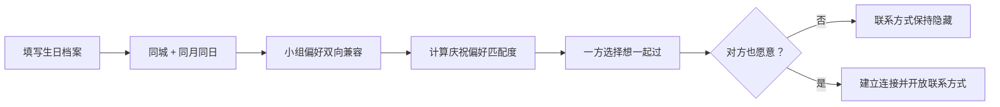
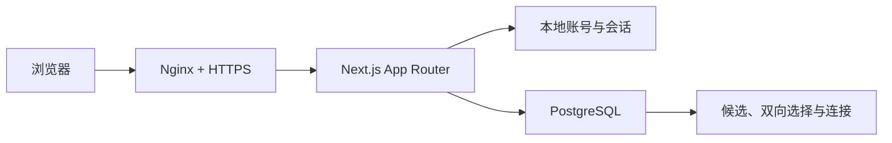

<p align="center">
  
</p>

<h1 align="center">今年我想好好过生日</h1>

<p align="center">
  让同一座城市、同一天生日，也想认真庆祝的人，在双方同意后认识彼此。
</p>

<p align="center">
  <a href="./README.en.md">English</a> ·
  <a href="#快速开始">快速开始</a> ·
  <a href="#服务器部署">服务器部署</a> ·
  <a href="https://github.com/rfdiosuao/birthday-match/issues">问题反馈</a>
</p>

<p align="center">
  
  
  
  
</p>

<p align="center">
  
</p>

## 这是什么

这是一个面向成年用户的同城生日匹配网站。系统先按生日月日、城市和小组偏好确定候选范围，再根据庆祝方式、预算、人数与共同活动计算匹配度。

候选阶段不会展示联系方式。只有双方都选择“想一起过”，系统才建立连接并向彼此开放联系方式。

## 已实现

- 邮箱和密码注册、登录，不依赖外部邮件服务
- 使用 `scrypt` 加盐保存密码
- HTTP-only、SameSite 会话 Cookie，数据库只保存令牌摘要
- 三步生日档案与年满 18 周岁确认
- 同城、同月同日及小组偏好双向筛选
- 庆祝方式、预算、人数与共同活动匹配度
- 双向同意后建立连接并开放联系方式
- 举报、屏蔽和暂停档案
- PostgreSQL 约束、事务和隐私边界
- Docker Compose、Nginx、健康检查与数据库备份

## 匹配机制



| 评分项 | 分值 |
| --- | ---: |
| 基础分 | 20 |
| 庆祝方式相同 | +28 |
| 预算相同或一方选择“可商量” | +20 |
| 期待人数相同 | +12 |
| 每项共同活动 | +8，最多 +32 |
| 最高分 | 100 |

## 技术架构



| 层 | 技术 |
| --- | --- |
| Web | Next.js 16、React 19、TypeScript |
| 登录 | 本地邮箱/密码、scrypt、数据库会话 |
| 数据 | PostgreSQL 15 |
| 校验 | Zod |
| 测试 | Vitest、PostgreSQL 集成测试 |
| 部署 | Docker Compose、Nginx、Let's Encrypt |

## 快速开始

需要 Node.js 20.9 或更高版本和一个 PostgreSQL 数据库。

```bash
git clone https://github.com/rfdiosuao/birthday-match.git
cd birthday-match
npm install
cp .env.example .env.local
npm run dev
```

先执行 [`database/schema.sql`](./database/schema.sql)，然后在 `.env.local` 中填写 `DATABASE_URL`。

常用检查：

```bash
npm run typecheck
npm run lint
npm test
npm run build
```

数据库集成测试需要单独提供测试数据库：

```bash
TEST_DATABASE_URL=postgresql://... npm test -- src/lib/data/repository.integration.test.ts
```

## 服务器部署

复制 `.env.example` 为 `.env.production`，至少修改：

- `POSTGRES_PASSWORD`：长随机密码
- `NEXT_PUBLIC_SITE_URL`：正式 HTTPS 地址
- `NEXT_PUBLIC_SUPPORT_EMAIL`：隐私与安全联系邮箱

启动：

```bash
docker compose --env-file .env.production up -d --build
```

应用默认只监听服务器的 `127.0.0.1:3020`，PostgreSQL 不映射宿主机端口。将 [`deploy/nginx.conf`](./deploy/nginx.conf) 安装到 Nginx 后，再使用 Certbot 配置 HTTPS。

数据库初始化文件位于 [`database/schema.sql`](./database/schema.sql)。已有数据库升级时执行：

```bash
APP_DIR=/opt/birthday-match ./deploy/migrate.sh
```

手动备份：

```bash
APP_DIR=/opt/birthday-match ./deploy/backup.sh
```

备份默认保存在 `/opt/birthday-match/backups`，保留 14 天。生产环境建议把该目录同步到另一台机器或对象存储。

## 安全与隐私

- 登录邮箱不会出现在候选资料中。
- 密码仅保存不可逆的带盐哈希。
- 原始会话令牌只存在于浏览器的 HTTP-only Cookie 中。
- PostgreSQL 不向公网暴露端口。
- 联系方式只有匹配成功的双方可以读取。
- 举报关系会阻止双方再次进入彼此的候选结果。
- 认证接口应在 Nginx 层限流。

上线前仍需根据运营主体和目标用户所在地，复核隐私政策、数据保护、未成年人保护、ICP备案及线下活动责任。

## 项目结构

```text
src/app/                 页面和 API Routes
src/components/          登录、档案、候选和连接组件
src/lib/auth/            密码、注册登录和会话
src/lib/data/            PostgreSQL 数据访问
database/schema.sql      数据表、约束和索引
deploy/                  Nginx、迁移和备份脚本
compose.yaml             应用与数据库编排
```

## 许可证

[MIT](./LICENSE)
