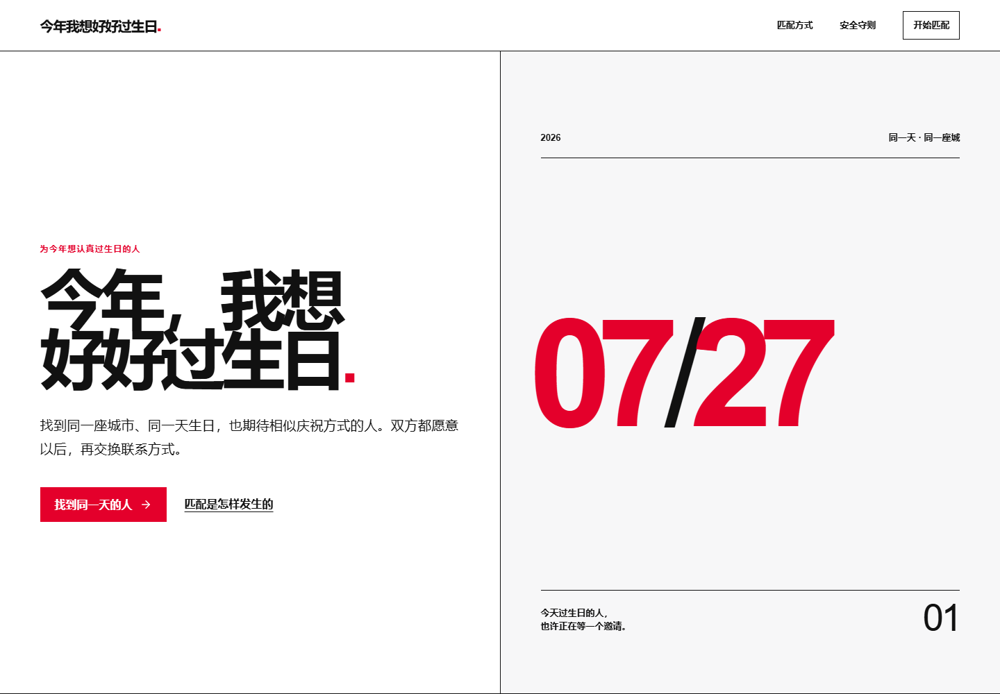

# 今年我想好好过生日

一个可部署的同城、同日生日双向匹配网站。候选阶段不公开联系方式；只有双方都选择“想一起过”后，系统才允许彼此读取联系方式。



## 已实现

- 邮箱 Magic Link 登录
- 三步生日档案与成年确认
- 同城、同月同日硬筛选
- 小组性别偏好双向兼容检查
- 庆祝方式、预算、人数与共同活动匹配度
- “想一起过 / 这次不合适”双向选择
- 双向同意后建立连接并开放联系方式
- 举报和双向屏蔽候选
- 档案暂停、隐私政策、用户协议和安全守则
- Supabase RLS：候选人无法直接查询其他用户的完整档案

## 本地运行

需要 Node.js 20.9 或更高版本。

```bash
npm install
Copy-Item .env.example .env.local
npm run dev
```

打开 `http://localhost:3000`。

## 1. 创建 Supabase 项目

1. 在 Supabase 创建项目。
2. 打开 SQL Editor，完整执行 [`supabase/schema.sql`](./supabase/schema.sql)。
3. 在 Project Settings → API 中复制 Project URL 和 anon public key。
4. 在 Authentication → URL Configuration 中设置：
   - Site URL：你的正式域名，例如 `https://birthday.example.com`
   - Redirect URLs：`https://birthday.example.com/auth/callback`
   - 本地开发可额外加入 `http://localhost:3000/auth/callback`
5. 在 Authentication → Providers 中开启 Email；推荐关闭邮箱密码登录，仅保留 Magic Link。

## 2. 配置环境变量

复制 `.env.example` 为 `.env.local`：

```env
NEXT_PUBLIC_SUPABASE_URL=https://your-project.supabase.co
NEXT_PUBLIC_SUPABASE_ANON_KEY=your-anon-key
NEXT_PUBLIC_SITE_URL=https://your-domain.example
NEXT_PUBLIC_SUPPORT_EMAIL=you@example.com
```

`NEXT_PUBLIC_SUPPORT_EMAIL` 会出现在隐私政策中，正式发布前必须替换为可用邮箱。

## 3. 部署到 Vercel

1. 将 `birthday-match-app` 推送到 Git 仓库。
2. 在 Vercel 新建项目；如果仓库还包含其他目录，将 Root Directory 设为 `birthday-match-app`。
3. 添加上面的四个环境变量。
4. 部署，并把最终域名更新回 `NEXT_PUBLIC_SITE_URL` 和 Supabase 的 Site URL / Redirect URLs。
5. 重新部署一次，使站点元数据使用最终域名。

Vercel 会自动执行 `npm run build`，无需额外构建命令。

## 上线前检查

```bash
npm run typecheck
npm run lint
npm test
npm run build
npm audit --omit=dev
```

还应完成以下运营准备：

- 用两个测试邮箱完成一次真实的双向匹配
- 确认 Supabase 邮件能够到达常用邮箱服务商
- 为举报建立处理人和响应时限
- 根据实际运营主体、部署地区和目标用户所在地复核隐私政策与合规要求
- 首批活动坚持公共场所、小组确认和紧急联系人机制

## 匹配规则

候选人首先必须满足：

1. 同一城市（自动去除末尾“市、区、县”等后缀）
2. 同一生日月日
3. 双方小组性别偏好兼容
4. 双方档案处于开启状态
5. 不存在举报、屏蔽或已建立连接

满足以上条件后，匹配度由以下部分组成：基础 20 分、庆祝方式相同 28 分、预算兼容 20 分、期待人数相同 12 分、每项共同活动 8 分，最高 100 分。

## 开源许可证

[MIT](./LICENSE)
